# TeamsPhoneNumberManagement Deployment Guide

This guide will help you deploy the TeamsPhoneNumberManagement solution in your environment.

## Prerequisites

You must have the following prerequisites to deploy the TeamsPhoneNumberManagement solution:

- [on-premises Active Directory](https://docs.microsoft.com/en-us/azure/active-directory/hybrid/plan-connect-topologies)
- [Azure Subscription](https://portal.azure.com)
- [Entra Identity](https://entra.microsoft.com/#view/Microsoft_AAD_IAM/TenantOverview.ReactView)
- [Microsoft Teams](https://admin.teams.microsoft.com/)
- [Microsoft Teams Enterprise Voice](https://learn.microsoft.com/en-us/microsoftteams/cloud-voice-landing-page)
- [PowerShell 7](https://learn.microsoft.com/en-us/powershell/scripting/install/installing-powershell?view=powershell-7.4)

## Deployment Steps

The deployment of the TeamsPhoneNumberManagement solution consists of the following steps:

1. [Download a copy of the solution](#download-a-copy-of-the-solution)
2. [Create an Azure resource group](#create-an-azure-resource-group)
3. [Create and configure an Azure SQL Database](#create-and-configure-an-azure-sql-database)
4. [Create and configure an Azure Function App](#create-and-configure-an-azure-function-app)
5. [Create and configure an Azure Automation Account](#create-and-configure-an-azure-automation-account)
6. [Test the solution](#test-the-solution)

## Download a copy of the solution

To download a copy of the solution, click the "Code" button in the top right corner of the [TeamsPhoneNumberManagement repository](https://github.com/jklotzsche-msft/teamsphonenumbermanagement) and select "Download ZIP". Extract the ZIP file to a location of your choice.

Then, open a PowerShell window and navigate to folder where you extracted the ZIP file using `cd <Path to the extracted ZIP file>`. You will find the following folders:

- [AutomationAccount](../AutomationAccount): Contains the Azure Automation Account runbook code.
- [Documentation](../Documentation): Contains the documentation for the TeamsPhoneNumberManagement solution, like the one you are currently reading.
- [FunctionApp](../FunctionApp): Contains the Azure Function App code.
- [Module](../Module): Contains the TeamsPhoneNumberManagement PowerShell module. This module is published to the PowerShell Gallery already and can be installed using `Install-Module -Name TeamsPhoneNumberManagement` or `Install-PSResource -Name TeamsPhoneNumberManagement`.

## Create an Azure resource group

First of all, we must create a resource group which will combine all necessary resources. To do so, go to [Azure Portal](https://portal.azure.com/#home), search for "Resource groups", switch to the service page and select "Create".

Select your subscription, provide a name (**Example name: `rg-TeamsPhoneNumberManagement`**) for your resource group, select your desired region and select "Review + create".

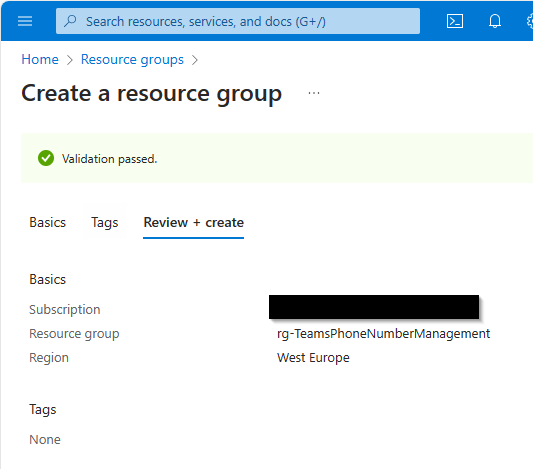

## Create and configure an Azure SQL Database

### Create the database and server

Next, we will create an Azure SQL Database. We will follow the instructions from ['Quickstart: Create a single database - Azure SQL Database'](https://learn.microsoft.com/en-us/azure/azure-sql/database/single-database-create-quickstart?view=azuresql&tabs=azure-portal) to create the database. The following information should be entered as part of the database creation process:

- **Subscription**: Select the subscription you want to use for the database.
- **Resource group**: Select the resource group you created in the previous step.
- **Database name**: Enter a name for the database. Example name: `sqldb-TeamsPhoneNumberManagement`.
- **Server**: Select "Create a new server" and enter a server name. Example name: `sql-teamsphonenumbermanagement`. Additionally, select 'Use Microsoft Entra-only authentication' as the authentication method and set a Microsoft Entra admin.
- **Want to use SQL elastic pool?**: Select "No".
- **Compute + storage**: Select "Configure database". Select the service and compute tier that best fits your needs. Recommended tier: `General Purpose` and `Serverless`. Select "Apply".
- **Backup storage redundancy**: Select "Locally redundant backup storage".

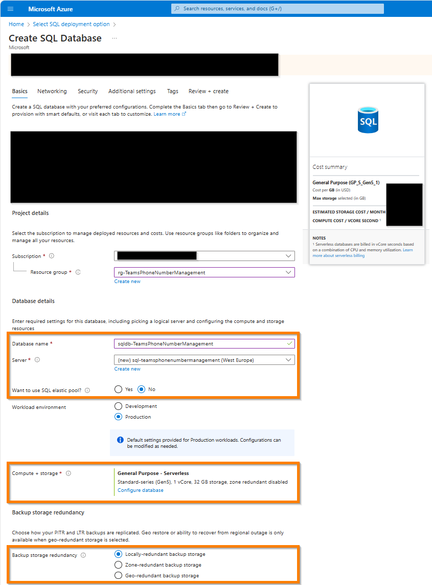

On the "Networking" tab, select "Public endpoint" and "Allow Azure services and resources to access this server". Then, select "Review + create" and "Create".

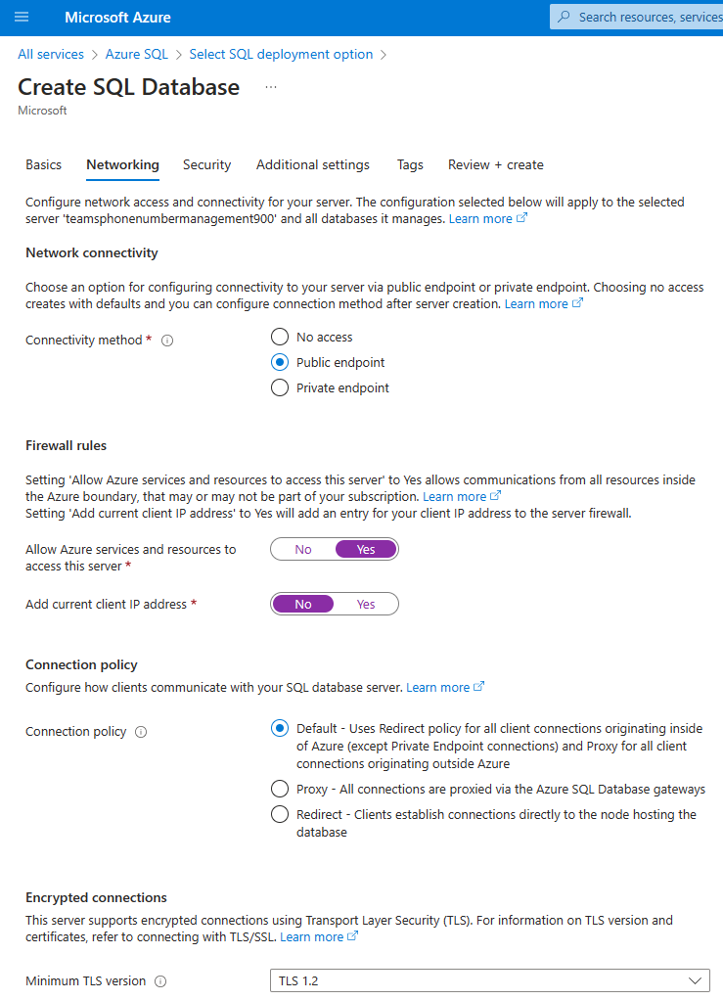

Leave other tabs and settings as default. Click "Review + create" and "Create".

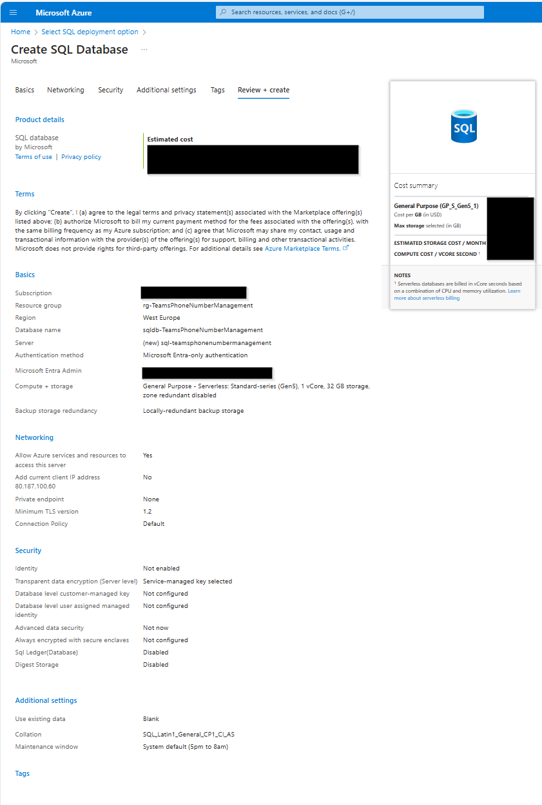

## Create and configure an Azure Function App

### Create the function app

Next, we will create an Azure Function App. We will follow the instructions from ['Create your first function in the Azure portal'](https://docs.microsoft.com/en-us/azure/azure-functions/functions-create-first-azure-function?tabs=in-portal) to create the function app. The following information should be entered as part of the function app creation process:

- **Subscription**: Select the subscription you want to use for the function app.
- **Resource group**: Select the resource group you created in the previous step.
- **Function app name**: Enter a name for the function app. Example name: `func-TeamsPhoneNumberManagement`.
- **Runtime stack**: Select "PowerShell Core" as the runtime stack.
- **Version**: Select "7.2" as the version. If you want to use the current version, although it's in Preview, select "7.4".
- **Region**: Select the region you want to use for the function app. Recommended region: `West Europe`.
- **Operating system**: Select "Windows" as the operating system.
- **Plan type**: Select "Consumption" as the plan type.

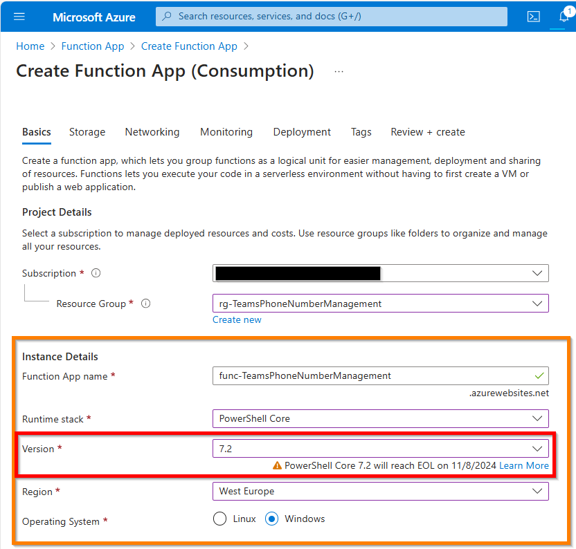

Leave other tabs and settings as default. Click "Review + create" and "Create".

### Configure the function app

We will have to configure the function app to use the system-assigned managed identity. To do so, go to the Azure Function App you created, select "Identity" and enable the system-assigned managed identity.

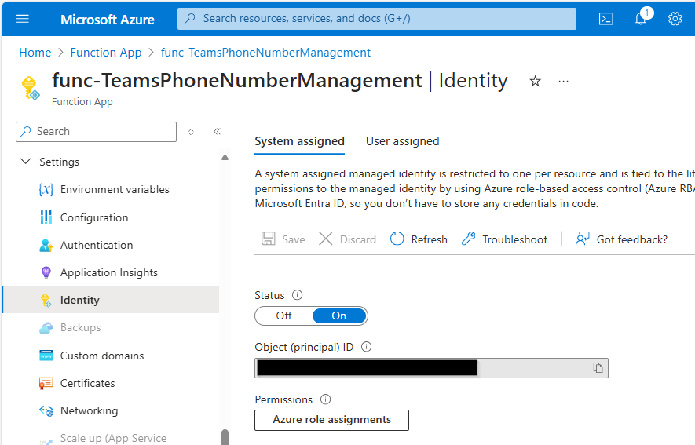

Additionally, we need environment variables for the SQLServerName and SQLDatabaseName. This is necessary to connect to the Azure SQL Database from the function app. To create them, go to the Azure Function App you created, select "Environment variables" and add the following environment variables:

- **SQLServerName**: The name of the Azure SQL Database server you created.
- **SQLDatabaseName**: The name of the Azure SQL Database you created.

Click the "Apply" button to save the environment variables. Accept the warning that the function app must be restarted to apply the changes.

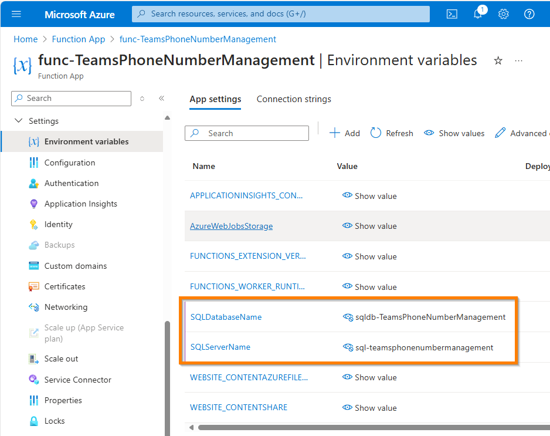

Lastly, we must enable a identity provider to assure, that only authenticated applications can access the function app. To do so, go to the Azure Function App you created, select "Authentication" and "Add identity provider". Select "Microsoft" as the identity provider. Then, the following information should be entered as part of the identity provider creation process:

- **Name**: Enter a name for the identity provider. Example name: `app-TeamsPhoneNumberManagement`.
- **Unauthenticated requests**: Select "HTTP 401 Unauthorized" as the action to take when requests are unauthenticated.

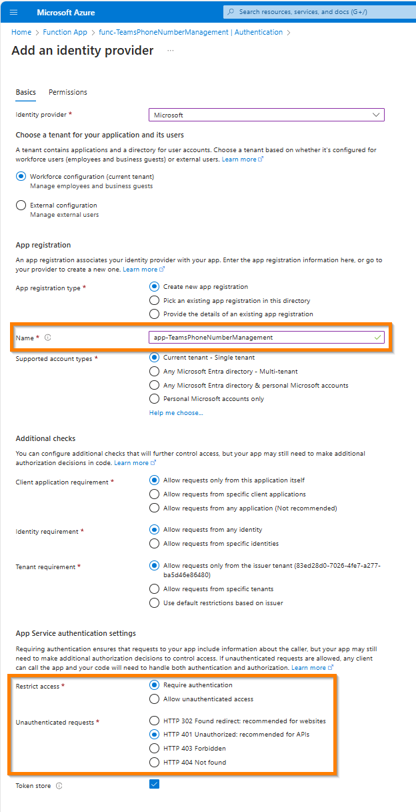

You could also create an app registration beforehand and use it as the identity provider. To learn more, check out [Azure Functions authentication and authorization](https://learn.microsoft.com/en-us/azure/azure-functions/security-concepts#enable-app-service-authenticationauthorization)

Leave other tabs and settings as default. Click "Add".

### Upload the function app code

> It is recommended to use Source Control to deploy the function app code. To learn more, check out [Continuous deployment for Azure Functions](https://learn.microsoft.com/en-us/azure/azure-functions/functions-continuous-deployment)

To upload the function app code, we will use the prepared PowerShell script [build.ps1](../FunctionApp/build/build.ps1). The script will create a zip file with the function app code and upload it to the Azure function app. You may have to install additional PowerShell modules and login to Azure using `Connect-AzAccount` before executing the script to upload the function app code. To execute the script, open a PowerShell window and navigate to the [FunctionApp/build](../FunctionApp/build) directory. Then, execute the following command:

```powershell
.\FunctionApp\build\build.ps1 -FunctionAppName "<Your FunctionApp Name>" -ResourceGroupName "<Your ResourceGroup Name>"
```

This will create a zip file with the function app code and upload it to the Azure function app. The function app code is located in the [FunctionApp](../FunctionApp) folder. The zip file contains the future API endpoints only. The `TeamsPhoneNumberManagement` module is part of the `requirements.psd1` file and will be installed automatically when the function app is started. The function app code will be uploaded to the function app and the function app will be restarted.

## Create and configure an Azure Automation Account

### Create the automation account

Next, we will create an Azure Automation Account. We will follow the instructions from ['Create an Automation Account'](https://docs.microsoft.com/en-us/azure/automation/automation-create-standalone-account?tabs=azure-portal) to create the automation account. The following information should be entered as part of the automation account creation process:

- **Subscription**: Select the subscription you want to use for the automation account.
- **Resource group**: Select the resource group you created in the previous step.
- **Automation account name**: Enter a name for the automation account. Example name: `aa-TeamsPhoneNumberManagement`.
- **Region**: Select the region you want to use for the automation account. Recommended region: `West Europe`.

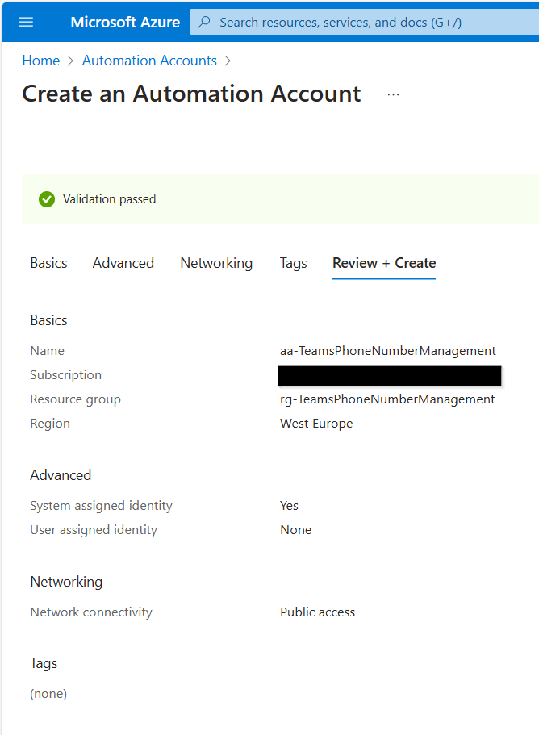

Leave other tabs and settings as default. Click "Review + create" and "Create".

### Configure the automation account

#### Enable the managed identity

We will have to configure the automation account to use the managed identity. By default, this happened at the creation of the Automation Account automatically. **If you disabled this option**, go to the Azure Automation Account you created, select "Identity" and enable the system-assigned managed identity.

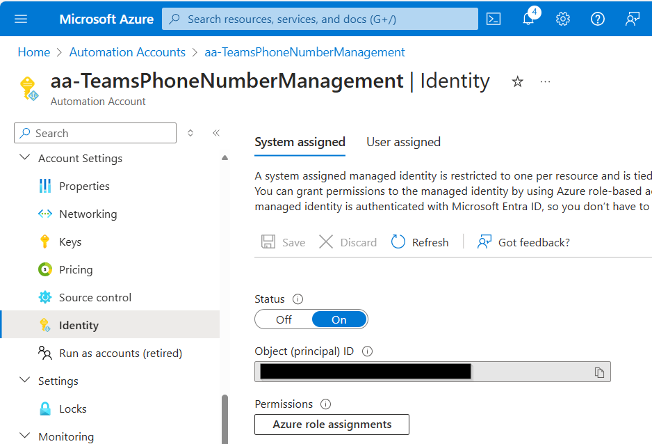

#### Add PowerShell modules

Next, we will add the necessary PowerShell modules to the automation account. To do so, go to the Azure Automation Account you created, select "Modules" and "Add a module". Then select "Browse from gallery", search for the following modules and add them to the automation account by selecting the module and clicking "Import". You will have to import the following modules one by one:

- **MicrosoftTeams (Created by: MicrosoftTeams)**: This module is used to interact with Microsoft Teams.
- **Azure.Function.Tools (Created by: Fred)**: This module is used to return the output of the Azure Function App and is a dependency of the TeamsPhoneNumberManagement module.
- **TeamsPhoneNumberManagement (Created by: jklotzsche-msft)**: This module is used to interact with the database.

Select for each module as runtime version at least `PowerShell 7.2` and click "Import". You can continue with the next section, while the modules are importing.

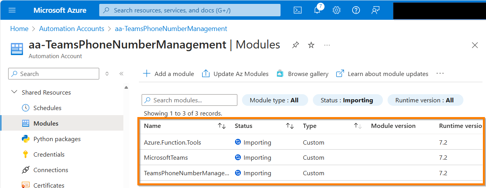

#### Add automation variables

Additionally, we need automation variables for our runbooks to run smoothly. To do so, go to the Azure Automation Account you created, select "Variables" and add the following variables:

- **TPNMAuto_SQLServerName**: The name of the Azure SQL Database server you created.
- **TPNMAuto_SQLDatabaseName**: The name of the Azure SQL Database you created.
- **TPNMAuto_PhoneNumberAssigmentResultSize**: The number of PSTN numbers to retrieve from Teams when updating the database. Should be equal or greater your maximum expected number of PSTN numbers in Teams.

If you want to enable Teams Phone using the automation account, you must add the following variables in addition:

- **TPNMAuto_OnboardingSecurityGroupId**: The security group ID for onboarding. The members of this group will be enabled for Teams Phone.
- **TPNM_PhoneNumberType**: The type of phone number. Should be, for example, 'DirectRouting' or 'CallingPlan'.
- **TPNMAuto_TeamsVoiceRoutingPolicy**: The name of the Microsoft Teams Online Voice Routing Policy.
- **TPNMAuto_TeamsDialPlanPolicy**: The name of the Microsoft Teams Online Dial Plan Policy.

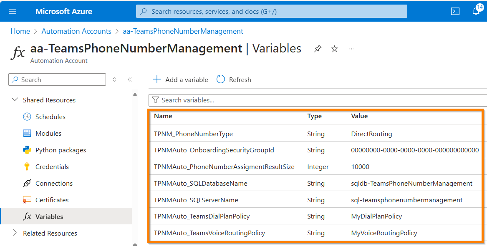

### Upload the runbook code

> It is recommended to use Source Control to deploy the runbook code. To learn more, check out [Source control integration](https://learn.microsoft.com/en-us/azure/automation/source-control-integration)

To upload the runbook code, we will use the prepared PowerShell script [Set-AzureRunBook.ps1](../AutomationAccount/build/Set-AzureRunbook.ps1). The script will create a runbook with the runbook code for each PowerShell file in the [runbook](../AutomationAccount/runbook/) folder and upload it to the automation account. To execute the script, open a PowerShell window and navigate to the [AutomationAccount/build](../AutomationAccount/build) directory. Then, execute the following command:

```powershell
.\AutomationAccount\build\Set-AzureRunbook.ps1 -AutomationAccountName "<Your AutomationAccount Name>" -ResourceGroupName "<Your ResourceGroup Name>" -Force -Confirm:$false
```

To learn more about the runbooks, check out the [Runbook documentation](./Runbooks.md).

### Add schedule to the runbooks

Lastly, we want our runbooks to run automatically on a schedule. To add a schedule to the uploaded runbooks, select `Schedules` in the Azure Automation Account and `Add a schedule`. Then, define the time schedule according to your needs. To learn more, check out [Create and manage schedules in Azure Automation](https://docs.microsoft.com/en-us/azure/automation/shared-resources/schedules)

Your schedule could look like this:

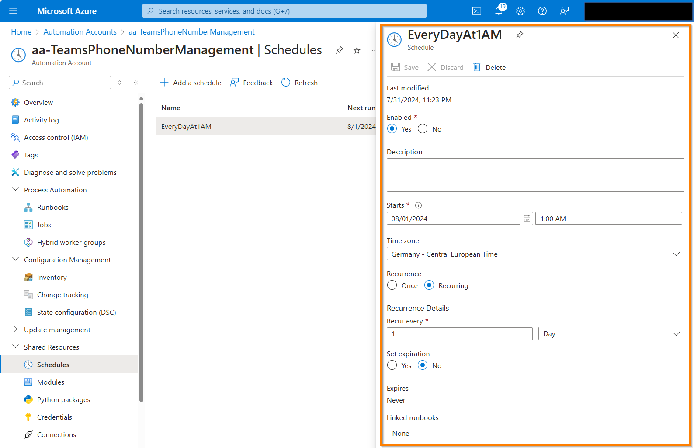

Now, all we have to do is link the runbooks to the schedule. To do so, select the runbook you want to link to the schedule, select `Schedules` and `Add a schedule`. Then, select the schedule you created earlier and click `OK`.

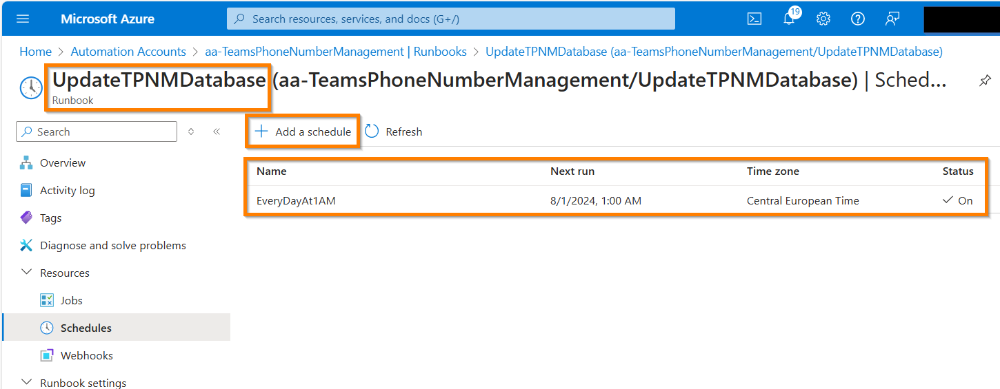

## Configure the Azure SQL Database

### Assign permissions to the database for the Azure Function App and Azure Automation Account

We must add the managed identites of the Azure Function App and Azure Automation Account to the database, so these resources are allowed to create, read, update and delete data from the database. To do so, go to the Azure SQL Database you created, open the "Query editor (preview)" and connect to the database using Microsoft Entra authentication. If your IP address has no firewall rule already, create one by clicking the "Allowlist IP xx.xx.xx.xx" link. Then, execute the following commands each for the Azure Function App and Azure Automation Account:

> IMPORTANT NOTE: You must keep the square brackets in the SQL commands. Replace the placeholders with the actual names of your resources.

```sql
CREATE USER [<Name of your Function App / Automation Account>] FROM EXTERNAL PROVIDER;
ALTER ROLE db_datareader ADD MEMBER [<Name of your Function App / Automation Account>];
ALTER ROLE db_datawriter ADD MEMBER [<Name of your Function App / Automation Account>];
GO
```

To learn more check out [Connect a function app to Azure SQL with managed identity and SQL bindings](https://learn.microsoft.com/en-us/azure/azure-functions/functions-identity-access-azure-sql-with-managed-identity)

### Create the necessary tables and data

After the database is prepared, we will create our tables. We will use [THIS SQL script](./TPNMDatabase.sql) to create the necessary tables. To execute the commands, we will use the Azure Portal's Query editor for now. To do so, go to the Azure SQL Database you created, select "Query editor (preview)" and connect to the database, if you are not connected from the previous step anymore. Then, copy the content of the [TPNMDatabase.sql](./TPNMDatabase.sql) file and execute it.

Now you got the necessary tables in your database. To learn more about the tables and the data, check out the [Database documentation](./TPNMDatabase.md).

From now on, you have three options to interact with the database:

1. **Use the Azure Function App API**: This is the recommended way to interact with the database. You can use the provided API endpoints to interact with the database. Please see the [API documentation](./Api.md) for more information.
2. **Use the PowerShell module from PowerShell Gallery**: This is a custom module to interact with the database, if you want to create your own PowerShell scripts or functions. Please check out the comment-based help for each function to learn more about the parameters and how to use them.

    ```powershell
    Install-Module -Name TeamsPhoneNumberManagement
    Get-Command -Module TeamsPhoneNumberManagement
    Get-Help Get-TPNMAllocation -Full
    ```

3. **Use the Azure Portal's Query editor**: This is a native GUI to interact with the database, although it is currently in preview.

## Test the solution

To test the solution, we first need a ClientSecret or ClientCertificate, which we will use to authenticate against Entra ID. To do so, go to the [Entra Identity](https://entra.microsoft.com/#view/Microsoft_AAD_IAM/TenantOverview.ReactView) and search for the app registration we created earlier for our Azure Function App. Then, select "Certificates & secrets" and create a new client secret. Copy the value of the client secret and save it for later.

Next, we will test the solution by executing the Azure Function. To do so, use the example code from the [API documentation](./Api.md) section `Example API Call`.

Additionally, you can use the `TeamsPhoneNumberManagement` PowerShell Module to interact with the database directly. To do so, install the module on your local machine and use the provided cmdlets to interact with the database. Get the module and check out the available functions as described above.

> Note: You will have to be authenticated against Azure using the `Connect-AzAccount` cmdlet to use the module, as well as the `Connect-TPNMDatabase` cmdlet to connect to the Azure SQL Database.

```powershell
Connect-AzAccount
```

```powershell
Connect-TPNMDatabase -SqlServerName "my-SQLServer" -SqlDatabaseName "my-SQLDatabase"
```

## Remove the solution

To remove the solution, we will delete the resource group we created. To do so, go to [Azure Portal](https://portal.azure.com/#home), search for "Resource groups", select the resource group you created and select "Delete resource group".

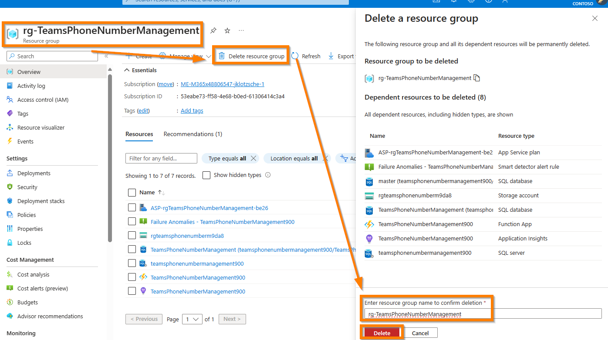

Additionally, we must remove the app registration we created earlier for our Azure Function App. To do so, go to the [Azure Portal](https://portal.azure.com/#home), search for "Azure Active Directory", select "App registrations" and search for the app registration we created earlier for our Azure Function App. Then, select the app registration and select "Delete".

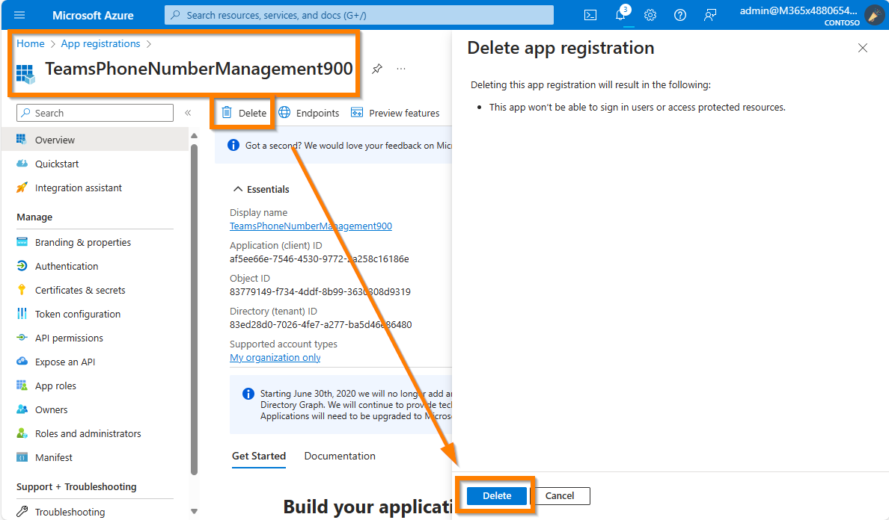