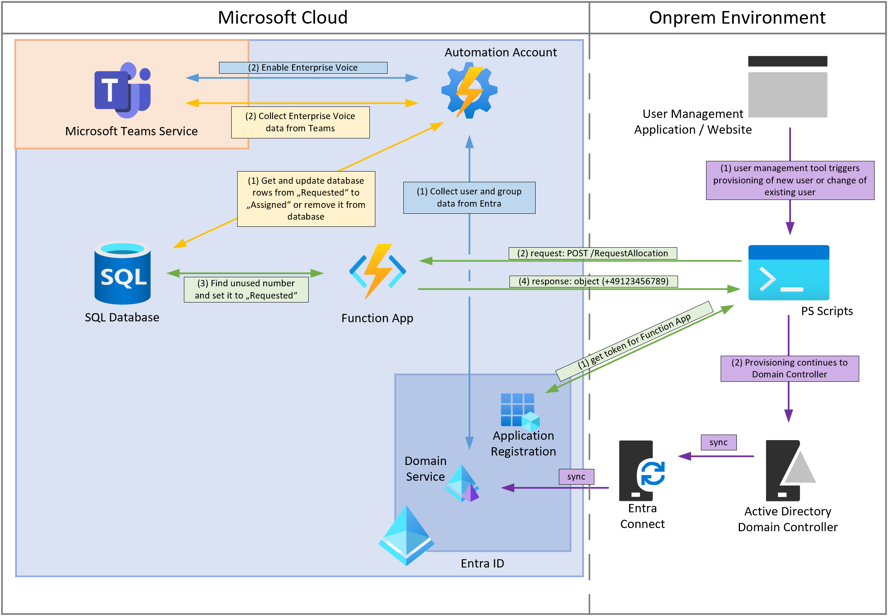

# TeamsPhoneNumberManagement - How to manage PSTN phone numbers for your Teams users

You are a Teams admin and you want to manage PSTN phone numbers for your Teams users, but your user accounts are synced from your on-premises Active Directory and you don't have a direct way to assign phone numbers to your users? Moreover, you have a complicated process to manage the phone numbers for your users manually and still no overview of the phone numbers that are assigned to your users?

Then this solution is for you! The TeamsPhoneNumberManagement solution provides you with a way to manage the phone numbers for your Teams users in a structured and automated way.

## Why TeamsPhoneNumberManagement?

The TeamsPhoneNumberManagement solution provides you with the following benefits:

- **Structured phone number management**: The solution provides you with a structured way to manage the phone numbers for your Teams users. You can define the phone numbers that are available for your Teams users and assign phone numbers to your users in a structured way.

- **Automated phone number management**: The solution automates the process of comparing the phone numbers that are assigned to your Teams users with the phone numbers that are available for your Teams users. The solution updates the phone numbers in the database accordingly.

- **Automated phone system enablement**: The solution automates the process of assigning a voice routing and dial plan policy and enabling the phone system for your Teams users.

- **API for phone number management**: The solution provides you with an API to manage the phone numbers for your Teams users. You can use this API to request phone numbers for your Teams users from any tool that can send HTTP requests.

- **Customizable**: The solution is built on top of Azure services and provides you with a way to manage the phone numbers for your Teams users in a structured and automated way. You can customize the solution to fit your needs.

- **Secure**: The solution is secured using Azure AD authentication. You can control who has access to the phone number management API.

- **Cost-effective**: The solution is built on top of Azure services and provides you with a cost-effective way to manage the phone numbers for your Teams users.

- **Open-source**: The solution is open-source and you can contribute to the solution on GitHub.

## Core components

This solution is built on top of Azure services and provides you with a way to manage the phone numbers for your Teams users in a structured and automated way.

## Deployment

Please refer to the [Deployment Guide](./Documentation/Deployment.md) for detailed instructions on deploying the TeamsPhoneNumberManagement solution. The deployment guide also includes the steps to create and configure the database, import the custom PowerShell module, and configure the Azure Function App and Automation Account.

The solution consists of the following components:

### TPNM database

This database contains the phone numbers that are available for your Teams users. It also contains the phone numbers that are assigned to your Teams users and forbidden extensions (e.g. emergency extensions for each country). The database is hosted in Azure SQL and can be accessed using the Azure portal, SQL Server Management Studio or the custom PowerShell module.

Please refer to the [database documentation](./Documentation/TPNMDatabase.md) for more information on the database schema.

### Custom PowerShell Module

This module contains the functions to manage the TPNM database. This module enables you to connect to the Azure SQL database and execute SQL queries using PowerShell syntax. This PowerShell module is also available on the [PowerShell Gallery as TeamsPhoneNumberManagement module](https://www.powershellgallery.com/packages/TeamsPhoneNumberManagement)

Please refer to the [comment-based help of the functions](./Module/TeamsPhoneNumberManagement/functions/httpTrigger) for more information on how to use the module. Alternatively, you can use the `Get-Help` cmdlet to get help for each function, e.g. `Get-Help Get-TPNMCountry`, after you have imported the module.

### Azure Function App as API

The Azure Function App provides an API to manage the TPNM database. The API is secured using Azure AD authentication and can be accessed using any tool that can send HTTP requests. The core of the Azure Function App is the custom PowerShell module that is used to manage the TPNM database. The very same functions that are available in the PowerShell module are also available in the Azure Function App as HTTP endpoints.

You can use this API to manage the phone numbers for your Teams users in a structured and automated way, as well as request phone numbers for your Teams users from any tool that can send HTTP requests.

Please refer to the [API documentation](./Documentation/Api.md) for more information on how to use the API.

### Automation Account runbooks

The solution provides you with a set of runbooks. The [Update-TPNMDatabase.ps1](./AutomationAccount/runbook/Update-TPNMDatabase.ps1) runbook automates the process of comparing the TPNM database with the phone numbers that are assigned to your Teams users and updating the phone numbers in the TPNM database accordingly. The [Enable-TeamsPhone.ps1](./AutomationAccount/runbook/Enable-TeamsPhone.ps1) runbook automates the process of assigning a voice routing and dial plan policy and enabling the phone system for your Teams users.

Please refer to the [runbook documentation](./Documentation/Runbooks.md) for more information on how to use the runbooks.

## License

This project is licensed under the MIT License - see the [LICENSE](./LICENSE) file for details.

## Feedback

If you have any feedback or questions, please feel free to open an issue on this repository. We are looking forward to your feedback!
